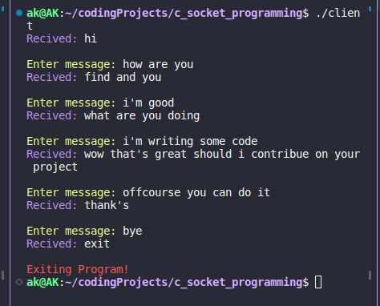
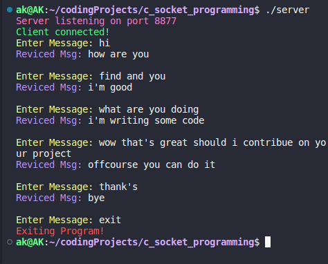

# Socket Programming in c

simple chat application in c with the help of socket programming.

## Structure of Socket

this is how Server and Client work in programming. 

<br>


<br>

## Server

you can initialize server just by compile it and run it.

```bash
gcc Server.c -o server
```
and then just type
```bash
./server
```

## Client

compile the client with this command

```bash
gcc Client.c -o client
```
to run client type this command
```bash
./client
```
<hr>

## Client Server Chat Application


